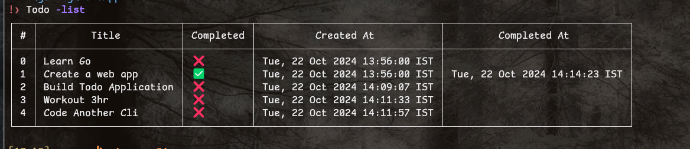

# Overview

# How to setup Localy 
1. Clone the repository
2. Open the project in your favorite IDE
3. Use the following command to  initialize the module `go mod init Todo` 
4. To Download all the dependencies use the command `go mod tidy`
5. Run the project using the command `go run main.go`

# To build the executable file 
    `go build -o Todo.exe`

Once build you can save the Executable file somewhere on you system and then add its path to the system environment variable to run it from anywhere in the system.

# To run use the following command and flag;
 Make sure run all the command into the terminal Since it's a cli tool
- Todo -list => list all the existing todo
- Todo -add "Your todo" => Add a new todo
- Todo -toggle "Todo ID" => Mark the todo as done
- Todo -del "Todo ID" => Delete the todo

